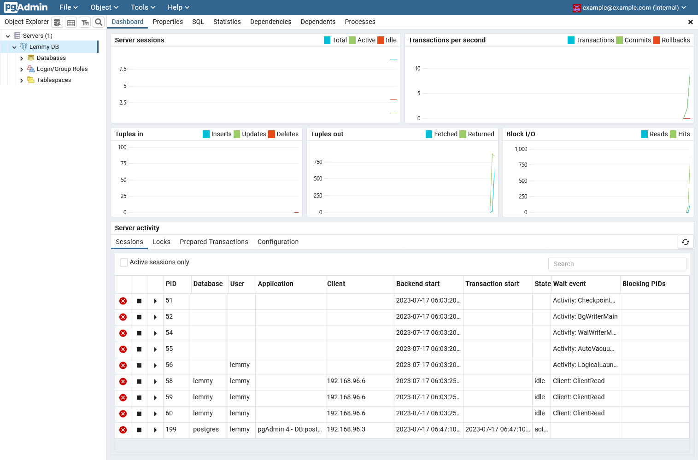

# Lemmy EZ-Mode

The idea here is you clone this repo, and configure your `.env` and then bring the compose stack online, and you should have a functioning lemmy instance.

There are a couple of ways to deploy Lemmy, I like deploying it using Traefik as the reverse proxy, I made this since the ansible template is hard to get running, and doesn't support Traefik.

I have added some really basic tests to make sure this stack always brings up a working container (at least in GitHub Workflows)

# Usage

1. Clone: `git clone https://github.com/tgxn/lemmy-ezmode.git`
2. Configure: Copy `.env.example` to `.env` and edit the values
3. Start: `docker-compose up -d`
4. Access: Visit the `LEMMY_BASE` URL

# Included Services

## Lemmy Services

- Traefik Balancer
 > Runs on port 80, and 443

- Lemmy & Lemmy-UI Server
 > These run on the docker network, and are not exposed to the host.

 

## Admin Services
These bind to local ports, and should only be accessible from your IPs.

**These are admin services, firewall them off to your IP only.**

- Traefik Admin Panel
 > Runs on port 81

- pgAdmin4 Container
 > Runs on port 82

# What/How

This uses a Traefik server to reverse proxy to the Lemmy server.
It uses the Traefik ACME challenge to automatically fetch and renew your certs.

You can optionally configure cloudflare credentials to automate SSL Certificate Verification with DNS.
